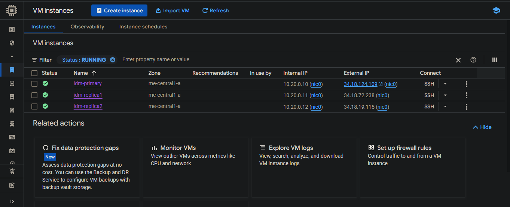
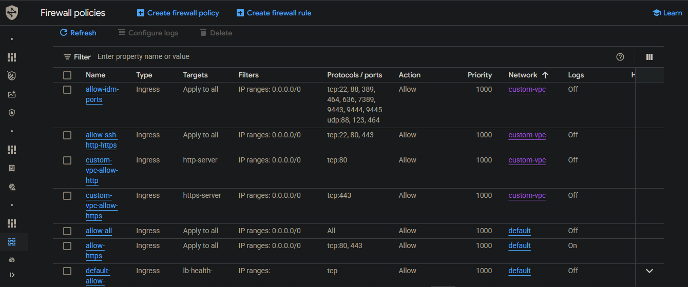
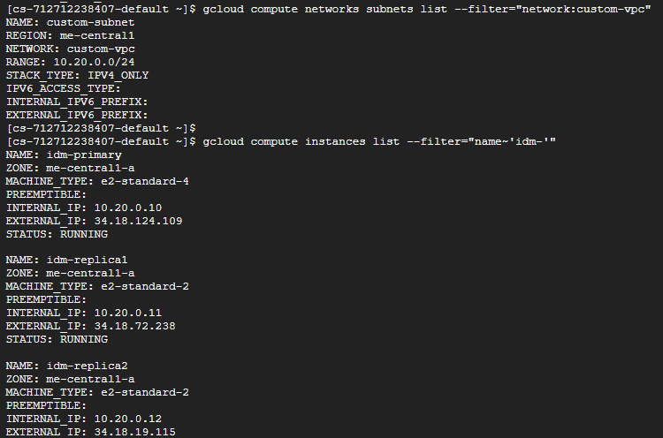
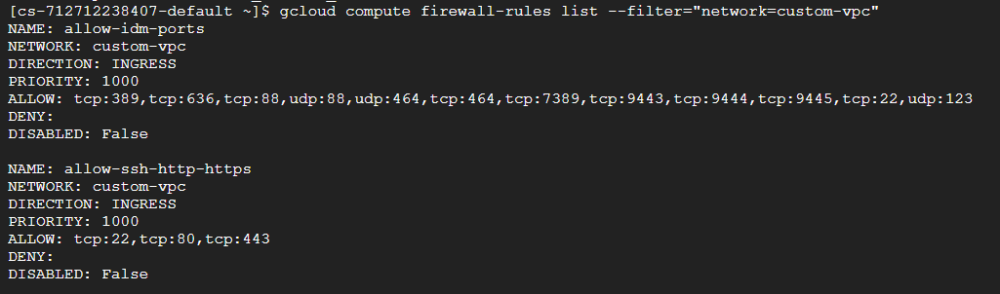
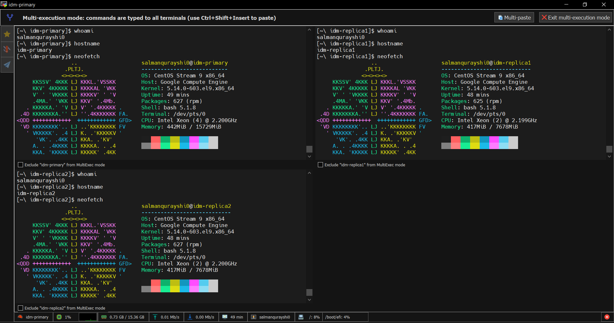
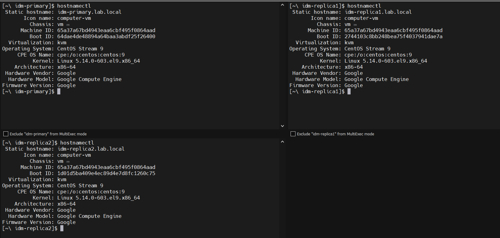
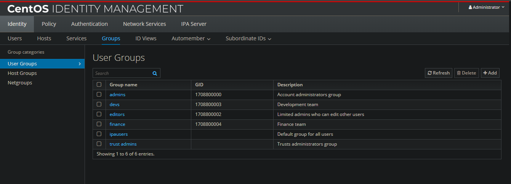
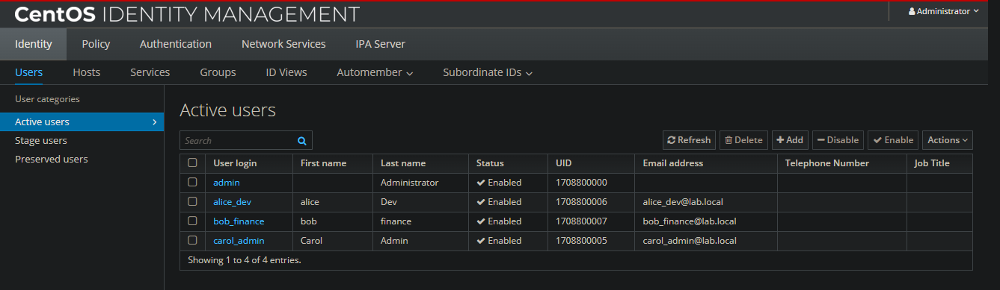
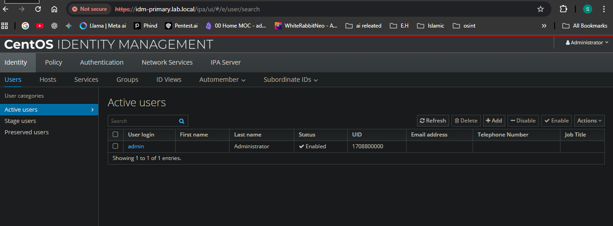

# Linux Identity & Security Foundations Project

Hi! I'm **Salman Qureshi**, and this project demonstrates the implementation of a **robust Identity Management (IdM) infrastructure** using **FreeIPA** on **Google Cloud Platform (GCP)**. The deployment showcases **enterprise-grade identity and access management capabilities**, including centralized authentication, authorization, and security policy enforcement across multiple servers.

## Project Overview

This project focuses on **designing a secure, scalable Linux identity and access management environment** with automation, following best practices in cloud security and Linux administration:

* **Identity & Access Management (IAM / IdM):** Centralized authentication and authorization using **FreeIPA**, enforcing consistent user and group policies across all hosts.
* **Authentication & Security:** Integration of **Kerberos** for secure ticket-based authentication and **PAM** for system login management.
* **Access Control:** Implementation of **Host-Based Access Control (HBAC) rules** to restrict access based on user, host, and service.
* **Infrastructure as Code (IaC):** Automated provisioning of GCP network and compute resources via **gcloud CLI**, ensuring repeatable and consistent deployments.
* **Security Best Practices:** Secure host configuration using **firewalld**, **SSH key authentication**, **FQDN-based hostnames**, and private IP addressing.

This project demonstrates **a full-stack approach to Linux security, identity management, and cloud infrastructure automation** — showcasing skills applicable to real-world enterprise environments.

##  Skills Demonstrated

* **Cloud Infrastructure:** Architected and deployed a multi-server environment using **GCP VPCs, subnets, and firewall rules**.
* **Identity & Access Management:** Implemented **centralized authentication**, user/group management, HBAC rules, and SUDO policies using FreeIPA.
* **Networking:** Configured hosts with **FQDNs**, managed `/etc/hosts` entries, and used **SSH tunneling** to securely access the FreeIPA web interface.
* **Linux System Administration:** Performed **system updates, package management (dnf)**, and service management via `systemctl`.
* **Security Configuration:** Applied **firewalld rules** and SSH key-based authentication to enforce a secure baseline.
* **Command Line Automation:** Leveraged **gcloud, ipa-server-install, and ipa-client-install** commands to follow **Infrastructure as Code principles**.
* **Web-Based Management:** Demonstrated **secure HTTPS-based administration** of the IdM infrastructure via SSH tunnels.
* **Monitoring & Validation:** Validated host enrollment, user authentication, service availability, and access control enforcement.

## Project Architecture

The project was deployed on **Google Cloud Platform** with the following custom infrastructure:

* **VPC:** `custom-vpc` — isolated network for security.
* **Subnet:** `custom-subnet` (`10.20.0.0/24`) in `me-central1` (Middle East - Qatar).
* **Firewall Rules:** `allow-ssh-http-https` — allows TCP 22, 80, 443 from anywhere (`0.0.0.0/0`).
* **VMs:**
  * `idm-primary` — FreeIPA server (`e2-standard-4`, 50 GB disk)
  * `idm-replica1` — FreeIPA replica (`e2-standard-2`, 30 GB disk)
  * `idm-replica2` — FreeIPA replica (`e2-standard-2`, 30 GB disk)

The architecture ensures **segregated network layers, secure host access, and scalable identity management**.


## Project Implementation & Configuration

This section documents the deployment and configuration steps for the Linux Identity & Security Foundations project. All commands and configurations reflect real-world enterprise practices, emphasizing security, automation, and repeatability.

---

### 1️⃣ Cloud Infrastructure Provisioning (IaC with CLI)

#### Custom VPC & Subnet Creation

   # Create a custom VPC
```
   gcloud compute networks create custom-vpc --subnet-mode=custom
```
   # Create a subnet in the Middle East (Qatar) region
```   gcloud compute networks subnets create custom-subnet \
     --network=custom-vpc \
     --region=me-central1 \
     --range=10.20.0.0/24
```
#### Firewall Rules – Allow SSH, HTTP, HTTPS

```   gcloud compute firewall-rules create allow-ssh-http-https \
     --network=custom-vpc \
     --allow tcp:22,tcp:80,tcp:443 \
     --source-ranges=0.0.0.0/0 \
     --description="Allow SSH, HTTP, HTTPS from anywhere"
```
#### VM Provisioning – Primary and Replica FreeIPA Servers

   # Primary FreeIPA server
```   gcloud compute instances create idm-primary \
     --zone=me-central1-a \
     --machine-type=e2-standard-4 \
     --subnet=custom-subnet \
     --private-network-ip=10.20.0.10 \
     --image=centos-stream-9-v20250812 \
     --image-project=centos-cloud \
     --boot-disk-size=50GB \
     --tags=idm-server \
     --metadata=enable-oslogin=FALSE
```
   # Replica 1
```   gcloud compute instances create idm-replica1 \
     --zone=me-central1-a \
     --machine-type=e2-standard-2 \
     --subnet=custom-subnet \
     --private-network-ip=10.20.0.11 \
     --image=centos-stream-9-v20250812 \
     --image-project=centos-cloud \
     --boot-disk-size=30GB \
     --tags=idm-server \
     --metadata=enable-oslogin=FALSE
```
   # Replica 2
```   gcloud compute instances create idm-replica2 \
     --zone=me-central1-a \
     --machine-type=e2-standard-2 \
     --subnet=custom-subnet \
     --private-network-ip=10.20.0.12 \
     --image=centos-stream-9-v20250812 \
     --image-project=centos-cloud \
     --boot-disk-size=30GB \
     --tags=idm-server \
     --metadata=enable-oslogin=FALSE
```






## Verify

After creation, list them:

```
gcloud compute instances list --filter="name~'idm-'"
```

```
gcloud compute networks subnets list --filter="network:custom-vpc"
```



```
gcloud compute firewall-rules list --filter="network=custom-vpc"
```



Then SSH:

```
gcloud compute ssh idm-primary --zone=me-central1-a
```

> i ssh'ed using MobaXterm by first adding my public key in the GCP VM edit section for each


---

✅ This will give us **3 servers ready in Qatar region**, with **SSH, HTTP, HTTPS open from anywhere**.

> used Qatar region because of reduced latency ( Qatar --> Pakistan )

### 🔹 Multi-Execution Mode with MobaXterm

To streamline configuration across all three VMs, I used **MobaXterm's Multi-Execution Mode**. This feature allows you to **run commands simultaneously on multiple SSH sessions**, saving time and reducing errors.  

Key points:  
- Commands executed on **all VMs at once** (idm-primary, idm-replica1, idm-replica2).  
- **Exclusion option**: You can temporarily exclude a VM if you only want to run commands on one or two servers.  
- Great for **hostname setup, system updates, package installations, and firewalld configuration**.  

Here’s a screenshot showing Multi-Execution Mode in action:



> Using this was **really exciting**!! Running commands across all servers at once felt **super powerful** and saved a ton of time.

---

### 2️⃣ Base Server Configuration

Performed on all nodes (Primary & Replicas):

#### 🔹 System Update & Package Installation
```
   sudo dnf update -y
   sudo dnf install -y vim bash-completion firewalld
```
#### 🔹 Hostname Configuration

   ### Example for idm-primary
```   
   sudo hostnamectl set-hostname idm-primary.lab.local
```
   ### Replicas
```   
   sudo hostnamectl set-hostname idm-replica1.lab.local
   sudo hostnamectl set-hostname idm-replica2.lab.local
```




### 🔹 Update `/etc/hosts`

Edit the file on **all servers**:

```
sudo vim /etc/hosts
```

Replace the default GCP lines so that our **lab FQDN is first**, but still keep the GCP-injected internal hostname as a secondary alias.

Final `/etc/hosts` should look like this:

```
127.0.0.1   localhost localhost.localdomain localhost4 localhost4.localdomain4
::1         localhost localhost.localdomain localhost6 localhost6.localdomain6

10.20.0.10   idm-primary.lab.local   idm-primary idm-primary.me-central1-a.c.windy-lyceum-464103-m5.internal
10.20.0.11   idm-replica1.lab.local  idm-replica1 idm-replica1.me-central1-a.c.windy-lyceum-464103-m5.internal
10.20.0.12   idm-replica2.lab.local  idm-replica2 idm-replica2.me-central1-a.c.windy-lyceum-464103-m5.internal

169.254.169.254 metadata.google.internal  # Added by Google

```

👉 Key points:

- The **`.lab.local`** FQDNs are **first** (FreeIPA will register these).
- The GCP internal names are kept as aliases (to avoid breaking Google’s tools).


#### 🔹 Firewalld Configuration
```
   sudo systemctl enable --now firewalld
   sudo firewall-cmd --permanent --add-service=ssh
   sudo firewall-cmd --permanent --add-service=ntp
   sudo firewall-cmd --reload
```

This ensures baseline host-level security in addition to GCP firewall rules.

---

### 3️⃣ FreeIPA Server Installation (idm-primary)

#### 🔹 Install Server Packages
```
   sudo dnf install -y ipa-server ipa-server-dns bind-dyndb-ldap
```
#### 🔹 Run FreeIPA Installer
```
   sudo ipa-server-install --setup-dns
```
Key Configuration Choices:

When prompted, answer like this (replace `CHANGE_ME_*` with strong passwords):

- **Server host name** → `idm-primary.lab.local`
- **Domain name** → `lab.local`
- **Realm name** → `LAB.LOCAL` (press Enter to accept)
- **Directory Manager password** → `CHANGE_ME_DM_PASS`
- **IPA admin password** → `CHANGE_ME_ADMIN_PASS`
- **Configure integrated DNS** → `Yes`
- **Configure DNS forwarders** → `Yes`
    - Add `8.8.8.8` (Google DNS)
    - Add `1.1.1.1` (Cloudflare DNS)
    - Do **NOT** add `169.254.169.254` (GCP metadata DNS – IPA rejects it)
- **NetBIOS name** → accept default `LAB`
- **Configure `chrony` with NTP server/pool** → `No`
- **Do you want to configure the system with these values?** → `Yes`

Ensures centralized authentication and DNS integration for the lab environment.

---

### 4️⃣ FreeIPA Replica Setup & Client Enrollment

Replicas are configured as **FreeIPA replica servers**, synchronized with `idm-primary`. Clients (replicas or other servers) can be enrolled for centralized authentication using `ipa-client-install`.

<details>
<summary>💡 Detailed Steps (Click to Expand)</summary>

### 4A. Install FreeIPA Client Packages

On **each replica**:

```
sudo dnf install -y ipa-client

```

### 4B. Run the Client Installer

```
sudo ipa-client-install --mkhomedir \
  --server=idm-primary.lab.local \
  --domain=lab.local

```

**Follow prompts:**

- Proceed with default/fixed values → `yes`
- Configure chrony with NTP → `no`
- Confirm hostname, realm, domain, IPA server → `yes`
- Enter IPA admin credentials → `admin` + IPA admin password

### 4C. Verify Enrollment

```
# Check hostnames
hostname

# Verify host records in FreeIPA
ipa host-show idm-replica1.lab.local
ipa host-show idm-replica2.lab.local

```

✅ Both replicas should now be enrolled with the primary IPA server.

</details>


---

### 5️⃣ Identity & Access Management (IAM) Configuration

Centralized user and group management is configured via **FreeIPA Web UI** or CLI.

<details>
<summary>💡 Web UI Steps & Users/Groups (Click to Expand)</summary>

### 5A. Create Groups

| Group Name | Description |
| --- | --- |
| admins | Full access users (IdM admins) |
| devs | Development team |
| finance | Finance team |




### 5B. Create Users

| Username | First Name | Last Name | Group | Email |
| --- | --- | --- | --- | --- |
| carol-admin | Carol | Admin | admins | carol@lab.local |
| alice-dev | Alice | Dev | devs | alice@lab.local |
| bob-finance | Bob | Finance | finance | bob@lab.local |
- Set an initial password (e.g., `Lab1234!`)
- Optional: uncheck “User must change password at next login” for testing




</details>

---

### 6️⃣ Secure Management & Web UI Access

Administrative access is secured via **SSH key authentication** and **HTTPS Web UI over SSH tunnel**.

<details>
<summary>💡 Detailed Steps (Click to Expand)</summary>

### 6A. Prepare SSH Tunnel (Windows PowerShell)

```powershell
ssh -i C:\Users\path\to\openssh-file -L 443:idm-primary.lab.local:443 <idm-primary-username>@<GCP-IP>
```

- `i <path>` → path to private key
- `L 443:idm-primary.lab.local:443` → forward local port 443 to FreeIPA server HTTPS
- Keep this terminal **open** to maintain the tunnel

### 6B. Map the Hostname (Optional)

Edit **Windows hosts file**:

```
C:\Windows\System32\drivers\etc\hosts

```

Add:

```
127.0.0.1   idm-primary.lab.local

```

### 6C. Access Web UI

In your browser:

```
https://idm-primary.lab.local/ipa/ui

```
- Accept self-signed certificate warning
- Login with:
    - **Username:** `admin`
    - **Password:** IPA admin password




### 6D. CLI Verification (Optional)

```
echo "==================== HOSTS ===================="
ipa host-find

echo -e "\n==================== HOST GROUPS ===================="
ipa hostgroup-find

echo -e "\n==================== USERS ===================="
ipa user-find

echo -e "\n==================== GROUPS ===================="
ipa group-find

echo -e "\n==================== SUDO RULES ===================="
ipa sudorule-find
for rule in $(ipa sudorule-find --all | awk '/Rule name:/ {print $3}'); do
    ipa sudorule-show $rule --all
done

echo -e "\n==================== HBAC SERVICES ===================="
ipa hbacsvc-find

echo -e "\n==================== HBAC RULES ===================="
ipa hbacrule-find
for rule in $(ipa hbacrule-find --all | awk '/Rule name:/ {print $3}'); do
    ipa hbacrule-show $rule --all
done

echo -e "\n==================== KERBEROS TICKETS ===================="
klist
```

<details> <summary>  My Setup output: (Click to Expand)</summary>
 
```
==================== HOSTS ====================
---------------
3 hosts matched
---------------
  Host name: idm-primary.lab.local
  Principal name: host/idm-primary.lab.local@LAB.LOCAL
  Principal alias: host/idm-primary.lab.local@LAB.LOCAL
  SSH public key fingerprint: SHA256:A6eviqSrJ0lQRgBvqtFIhiW4aLKK3AZHu870LA1jiCM root@idm-primary (ssh-ed25519), SHA256:BSH8oMBAaEzhdDf5bb5Q7eHjNV7sdYR+GSLlyjN0lXY root@idm-primary
                              (ecdsa-sha2-nistp256), SHA256:6HcA1XECR/f9MgLGIRrhF+HAfs3to6y+Sk6CIbyIEik root@idm-primary (ssh-rsa)

  Host name: idm-replica1.lab.local
  Platform: x86_64
  Operating system: 5.14.0-603.el9.x86_64
  Principal name: host/idm-replica1.lab.local@LAB.LOCAL
  Principal alias: host/idm-replica1.lab.local@LAB.LOCAL
  SSH public key fingerprint: SHA256:vV4cfZINEqIWUs7J2nhtnSAHtV7q9TifkGZIwDKMAOM root@idm-replica1 (ssh-ed25519), SHA256:q+aNxhuASTqxmtxKkRx1yeis+r+J/wi1TDtFJjwfvMU root@idm-replica1
                              (ecdsa-sha2-nistp256), SHA256:CbqELHhQka/vPSeGjZmNFeaMoT02iJbs77KnQais6fI root@idm-replica1 (ssh-rsa)

  Host name: idm-replica2.lab.local
  Platform: x86_64
  Operating system: 5.14.0-603.el9.x86_64
  Principal name: host/idm-replica2.lab.local@LAB.LOCAL
  Principal alias: host/idm-replica2.lab.local@LAB.LOCAL
  SSH public key fingerprint: SHA256:PcVaf2tpHqGOxAqxaV8ZWY1xQclPtAS9rZcj/ZaV2JY root@idm-replica2 (ssh-ed25519), SHA256:i7NA+pSEmxluosi/zMAOIdQw/iTvXEJkmd/YJtWeXh0 root@idm-replica2
                              (ecdsa-sha2-nistp256), SHA256:fBPFzqeSU/aMayAo2XUJ5XwlPCa97FmPDxhUQdyNOdA root@idm-replica2 (ssh-rsa)
----------------------------
Number of entries returned 3
----------------------------

==================== HOST GROUPS ====================
-------------------
1 hostgroup matched
-------------------
  Host-group: ipaservers
  Description: IPA server hosts
----------------------------
Number of entries returned 1
----------------------------

==================== USERS ====================
---------------
4 users matched
---------------
  User login: admin
  Last name: Administrator
  Home directory: /home/admin
  Login shell: /bin/bash
  Principal name: admin@LAB.LOCAL
  Principal alias: admin@LAB.LOCAL, root@LAB.LOCAL
  UID: 1708800000
  GID: 1708800000
  Account disabled: False

  User login: alice_dev
  First name: alice
  Last name: Dev
  Home directory: /home/alice_dev
  Login shell: /bin/sh
  Principal name: alice_dev@LAB.LOCAL
  Principal alias: alice_dev@LAB.LOCAL
  Email address: alice_dev@lab.local
  UID: 1708800006
  GID: 1708800006
  Account disabled: False

  User login: bob_finance
  First name: bob
  Last name: finance
  Home directory: /home/bob_finance
  Login shell: /bin/sh
  Principal name: bob_finance@LAB.LOCAL
  Principal alias: bob_finance@LAB.LOCAL
  Email address: bob_finance@lab.local
  UID: 1708800007
  GID: 1708800007
  Account disabled: False

  User login: carol_admin
  First name: Carol
  Last name: Admin
  Home directory: /home/carol_admin
  Login shell: /bin/sh
  Principal name: carol_admin@LAB.LOCAL
  Principal alias: carol_admin@LAB.LOCAL
  Email address: carol_admin@lab.local
  UID: 1708800005
  GID: 1708800005
  Account disabled: False
----------------------------
Number of entries returned 4
----------------------------

==================== GROUPS ====================
----------------
6 groups matched
----------------
  Group name: admins
  Description: Account administrators group
  GID: 1708800000

  Group name: devs
  Description: Development team
  GID: 1708800003

  Group name: editors
  Description: Limited admins who can edit other users
  GID: 1708800002

  Group name: finance
  Description: Finance team
  GID: 1708800004

  Group name: ipausers
  Description: Default group for all users

  Group name: trust admins
  Description: Trusts administrators group
----------------------------
Number of entries returned 6
----------------------------

==================== SUDO RULES ====================
-------------------
1 Sudo Rule matched
-------------------
  Rule name: admins_all_sudo
  Description: Full sudo access for admins group
  Enabled: True
----------------------------
Number of entries returned 1
----------------------------
  dn: ipaUniqueID=8e454194-8408-11f0-a69b-42010a14000a,cn=sudorules,cn=sudo,dc=lab,dc=local
  Rule name: admins_all_sudo
  Description: Full sudo access for admins group
  Enabled: True
  User Groups: admins
  Hosts: idm-primary.lab.local
  ipauniqueid: 8e454194-8408-11f0-a69b-42010a14000a
  objectclass: ipaassociation, ipasudorule

==================== HBAC SERVICES ====================
------------------------
17 HBAC services matched
------------------------
  Service name: crond
  Description: crond

  Service name: ftp
  Description: ftp

  Service name: gdm
  Description: gdm

  Service name: gdm-password
  Description: gdm-password

  Service name: gssftp
  Description: gssftp

  Service name: kdm
  Description: kdm

  Service name: login
  Description: login

  Service name: proftpd
  Description: proftpd

  Service name: pure-ftpd
  Description: pure-ftpd

  Service name: ssh
  Description: SSH access

  Service name: sshd
  Description: sshd

  Service name: su
  Description: su

  Service name: su-l
  Description: su with login shell

  Service name: sudo
  Description: sudo

  Service name: sudo-i
  Description: sudo-i

  Service name: systemd-user
  Description: pam_systemd and systemd user@.service

  Service name: vsftpd
  Description: vsftpd
-----------------------------
Number of entries returned 17
-----------------------------

==================== HBAC RULES ====================
--------------------
4 HBAC rules matched
--------------------
  Rule name: allow_all
  User category: all
  Host category: all
  Service category: all
  Description: Allow all users to access any host from any host
  Enabled: True

  Rule name: allow_systemd-user
  User category: all
  Host category: all
  Description: Allow pam_systemd to run user@.service to create a system user session
  Enabled: True

  Rule name: ssh_alice_only_replica2
  Description: Only alice-dev can SSH to replica2
  Enabled: True

  Rule name: ssh_bob_only_replica1
  Description: Only bob-finance can SSH to replica1
  Enabled: True
----------------------------
Number of entries returned 4
----------------------------
  dn: ipaUniqueID=9b284316-83ef-11f0-b080-42010a14000a,cn=hbac,dc=lab,dc=local
  Rule name: allow_all
  User category: all
  Host category: all
  Service category: all
  Description: Allow all users to access any host from any host
  Enabled: True
  accessruletype: allow
  ipauniqueid: 9b284316-83ef-11f0-b080-42010a14000a
  objectclass: ipaassociation, ipahbacrule
  dn: ipaUniqueID=9b2b38b4-83ef-11f0-a8b9-42010a14000a,cn=hbac,dc=lab,dc=local
  Rule name: allow_systemd-user
  User category: all
  Host category: all
  Description: Allow pam_systemd to run user@.service to create a system user session
  Enabled: True
  HBAC Services: systemd-user
  accessruletype: allow
  ipauniqueid: 9b2b38b4-83ef-11f0-a8b9-42010a14000a
  objectclass: ipaassociation, ipahbacrule
  dn: ipaUniqueID=4f6508da-840b-11f0-95f2-42010a14000a,cn=hbac,dc=lab,dc=local
  Rule name: ssh_alice_only_replica2
  Description: Only alice-dev can SSH to replica2
  Enabled: True
  Users: alice_dev
  Hosts: idm-replica2.lab.local
  HBAC Services: ssh
  accessruletype: allow
  ipauniqueid: 4f6508da-840b-11f0-95f2-42010a14000a
  objectclass: ipaassociation, ipahbacrule
  dn: ipaUniqueID=4962d2fa-840b-11f0-8ffd-42010a14000a,cn=hbac,dc=lab,dc=local
  Rule name: ssh_bob_only_replica1
  Description: Only bob-finance can SSH to replica1
  Enabled: True
  Users: bob_finance
  Hosts: idm-replica1.lab.local
  accessruletype: allow
  ipauniqueid: 4962d2fa-840b-11f0-8ffd-42010a14000a
  objectclass: ipaassociation, ipahbacrule

==================== KERBEROS TICKETS ====================
Ticket cache: KCM:1001
Default principal: admin@LAB.LOCAL

Valid starting       Expires              Service principal
08/28/2025 09:24:03  08/29/2025 09:08:38  HTTP/idm-primary.lab.local@LAB.LOCAL
08/28/2025 09:24:02  08/29/2025 09:08:38  krbtgt/LAB.LOCAL@LAB.LOCAL
[~\ idm-primary]$
```
</details>
</details>

---

## Key Achievements

* **Cloud Infrastructure & IaC:** Architected and deployed a **custom VPC, subnet, firewall rules, and virtual machines** using **GCP CLI**, demonstrating **Infrastructure as Code principles**.
* **Identity & Access Management (IAM):** Implemented a **centralized authentication and authorization system** with FreeIPA, including **Kerberos authentication**, **host enrollment**, **user/group policies**, and **access control rules**.
* **Linux System Administration:** Configured **hostnames, FQDNs, /etc/hosts entries**, performed **package management** (`dnf`), and set up **host firewalld rules**, ensuring secure system baselines.
* **Secure Management Practices:** Enabled **SSH key authentication** and **HTTPS-based administration** via **SSH tunnels**, demonstrating secure remote management of critical systems.
* **Networking & Security:** Configured **private network IPs**, **host-based access control (HBAC)**, **firewall rules**, and **SUDO policies**, enforcing **least privilege principles**.
* **Automation & CLI Proficiency:** Leveraged **gcloud**, `ipa-server-install`, and `ipa-client-install` commands for **repeatable, automated deployments**, reducing manual configuration errors.

## 🔹 Technologies & Security Concepts Utilized

* **Google Cloud Platform (GCP):** VPC, Subnet, Firewall, VM instances
* **FreeIPA:** Identity management, Kerberos authentication, DNS integration
* **Linux (CentOS Stream 9):** System configuration, service management, package updates
* **Security Tools & Concepts:** SSH, HTTPS, SUDO rules, HBAC, Kerberos tickets, access control
* **Infrastructure as Code (IaC):** Command-line automation with **repeatable deployment scripts**

## 🔹 Project Impact

* Demonstrates a **secure multi-server IdM environment** suitable for enterprise or lab testing
* Provides a **repeatable blueprint** for deploying **FreeIPA on cloud infrastructure**
* Strengthens understanding of **cloud networking, identity management, and Linux security best practices**
* Illustrates **integration of cloud, security, and automation skills** in a professional project
