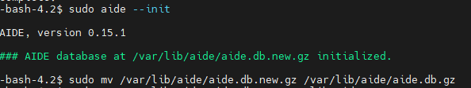
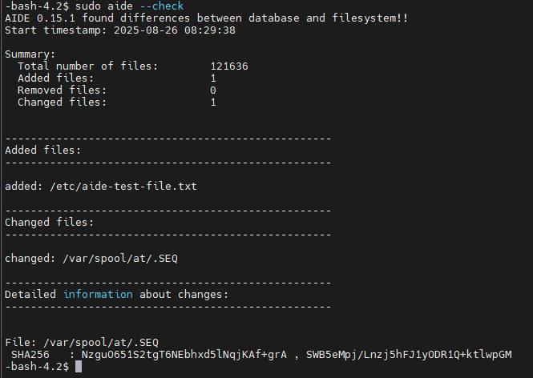

# File Integrity Monitoring with AIDE

## Project Overview
For this project, I used **AIDE (Advanced Intrusion Detection Environment)** to set up a file integrity monitoring system on a Linux server. The main goal was to create a cryptographic baseline of the system's files and then prove that the tool could successfully detect unauthorized changes. This is a crucial skill for security professionals who need to detect tampering and malicious activity.

## The Tool: AIDE
AIDE is an essential tool for **file integrity monitoring (FIM)**. It works by creating a snapshot of the file system at a specific moment in time. This snapshot, or **baseline**, is a database containing cryptographic hashes and other file attributes (like permissions and size). When I run a check, AIDE compares the current state of the files against the original baseline. If a file has been added, removed, or changed in any way, AIDE will report it.

## Methodology and Project Steps
I began by installing AIDE on my CentOS lab environment using the package manager.

### Step 1: Install AIDE
```
   sudo yum install aide -y
```
### Step 2: Create the Initial Database
Next, I created the initial baseline database, which is a snapshot of the system's current state. This step is the foundation of the entire process.
```
   sudo aide --init
```



### Step 3: Rename the Database
After the `aide --init` command finished, I had a new database file named `aide.db.new.gz`. I had to rename this file to `aide.db.gz` so AIDE would recognize it for future checks.
```
   sudo mv /var/lib/aide/aide.db.new.gz /var/lib/aide/aide.db.gz
```
### Step 4: Trigger an Integrity Change
To prove that AIDE works, I intentionally created a new, empty file in a monitored directory. This action would simulate a change that an attacker might make on the system.
```
   sudo touch /etc/aide-test-file.txt
```
### Step 5: Perform an Integrity Check
Finally, I ran AIDE again with the `--check` command. This told the tool to compare the current file system with the baseline I created in Step 2.
```
   sudo aide --check
```
## Project Analysis and Results
The results of the check were a complete success! The `aide --check` command produced a report that accurately reflected the changes I made.

Here is the output I received:




* **Added Files:** AIDE correctly identified `added: /etc/aide-test-file.txt`. This proves the tool can detect a new file that wasn't in the original baseline.
* **Changed Files:** The output also showed a change to `/var/spool/at/.SEQ`. This is a normal, expected change on a running Linux system, demonstrating how AIDE will flag **any** modification, no matter how small.

By completing this project, I proved my ability to configure, use, and analyze a crucial security tool for detecting system tampering.