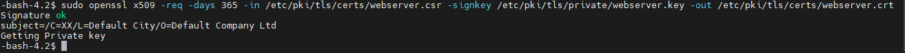
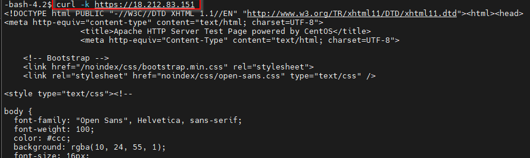

# Securing Network Communication with TLS

## Project Overview
In this project, I secured network communication by configuring an Apache web server to use **TLS (Transport Layer Security)**. The goal was to demonstrate how to encrypt data in transit, protecting it as it travels between a server and a client. This is a critical skill for any security professional working with web servers or other network services.

## The Tools: `openssl` and Apache (`httpd`)
* `openssl`: This powerful command-line tool is used for all things related to cryptography, including generating private keys and creating TLS certificates.
* **Apache** (`httpd`): This is a widely used web server. I configured it to use the TLS key and certificate I created, so it could serve content over a secure HTTPS connection.

## Methodology and Project Steps
I followed a series of steps to generate a self-signed TLS certificate and configure my web server to use it.

### Step 1: Install the Necessary Packages
First, I installed the Apache web server (`httpd`), the `openssl` tool, and the `mod_ssl` module, which contains the SSL configuration file for Apache.
```
   sudo yum install openssl httpd mod_ssl -y
```
### Step 2: Generate the Private Key
Next, I used `openssl` to generate a private key. This key is used for the encryption process and must be kept secret.
```
   sudo openssl genpkey -algorithm RSA -out /etc/pki/tls/private/webserver.key
```
### Step 3: Create a Certificate Signing Request (CSR)
I created a Certificate Signing Request (CSR) file. This file contains information about the server and is used as input for creating the certificate.
```
   sudo openssl req -new -key /etc/pki/tls/private/webserver.key -out /etc/pki/tls/certs/webserver.csr
```
### Step 4: Generate a Self-Signed Certificate
Using the key and CSR I just created, I generated a self-signed TLS certificate. For a lab environment, a self-signed certificate is perfect for proving that the encryption is working.
```
   sudo openssl x509 -req -days 365 -in /etc/pki/tls/certs/webserver.csr -signkey /etc/pki/tls/private/webserver.key -out /etc/pki/tls/certs/webserver.crt
```



### Step 5: Configure Apache to Use the Certificate
I edited the Apache SSL configuration file (`/etc/httpd/conf.d/ssl.conf`) and updated two key lines to point to the new certificate and private key files.
```
   SSLCertificateFile /etc/pki/tls/certs/webserver.crt
   SSLCertificateKeyFile /etc/pki/tls/private/webserver.key
```
### Step 6: Start the Web Server
I started the Apache web server and enabled it to run on boot.
```
   sudo systemctl start httpd
   sudo systemctl enable httpd
```
### Step 7: Open the Firewall Port
Initially, the server's firewall was blocking external access on port 443 (the standard port for HTTPS). I used `firewall-cmd` to open the port.
```
   sudo firewall-cmd --permanent --add-service=https
   sudo firewall-cmd --reload
```
## Project Analysis and Results
After completing all the configuration steps, I tested the connection from my client to the server's public IP address using the `curl` command.

The initial test failed with a "No route to host" error, which confirmed that my firewall was properly blocking the connection. After opening port 443, the second test was a complete success.

Here is the `curl` command I used and the successful output I received:
```
   curl -k https://<my_server_ip>
```




The HTML output shows that my client was able to connect to my server and download the default Apache welcome page, confirming that the entire TLS connection was working correctly. The `-k` flag was essential here because my certificate was self-signed and not trusted by default.

By completing this project, I demonstrated my ability to generate and implement TLS certificates, configure a web server, and manage firewall rules—all crucial skills for securing network communications.